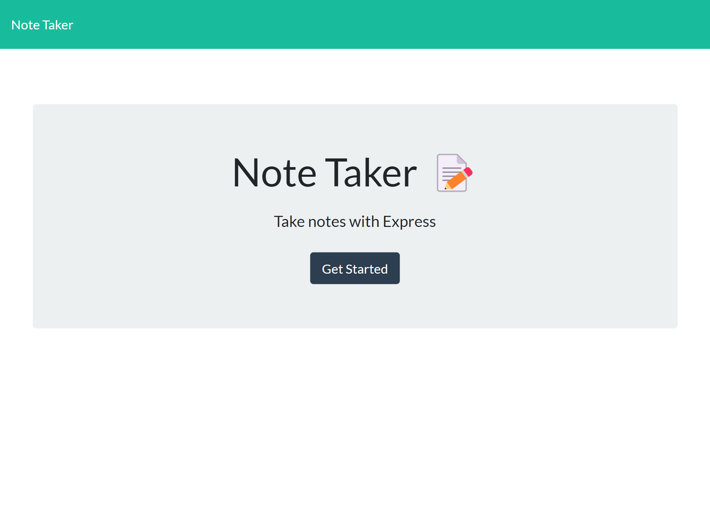
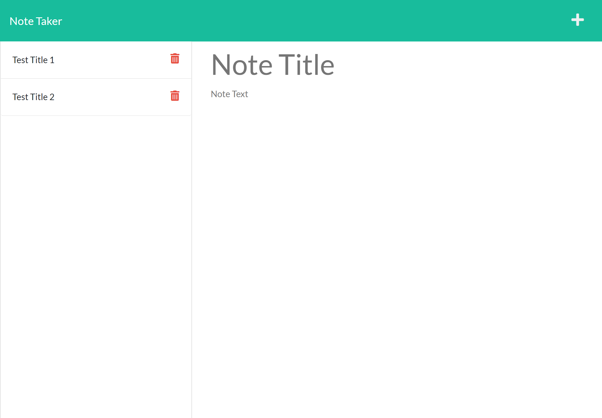
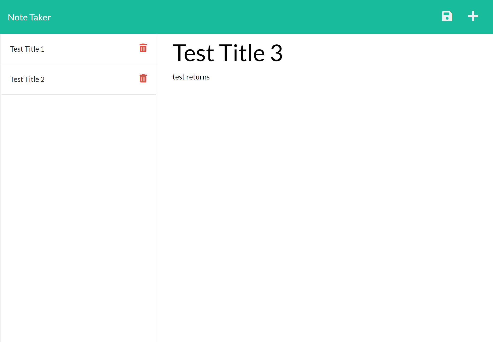
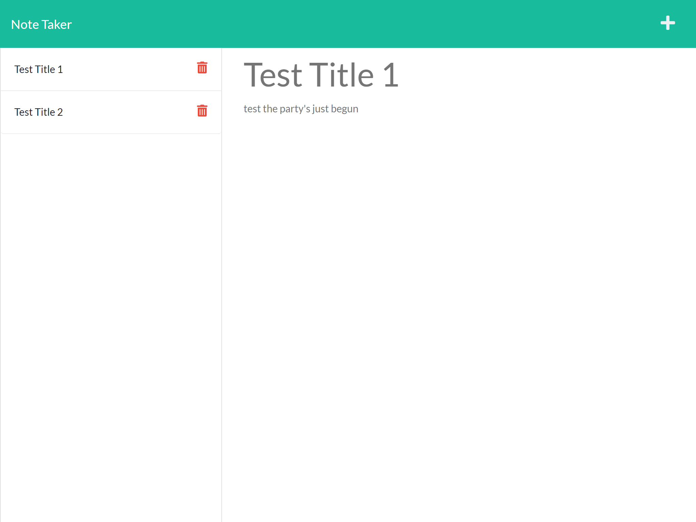

# note-taker

## Description 

Note Taker was created to create notes on various things and to help keep organize. It will assist in keeping track of tasks and keep the user on track. The user will be able to make notes and save them. This project uses HTML, CSS, Javascript, and Node. A link to the application on heroku can be found below:

## Table of Contents

* [Installation](#installation)
* [Usage](#usage)

* [Contributing](#contributing)
* [Tests](#tests)
* [Questions](#questions)

## Installation

First, You download the zip file from the repo on Github. Next, you extract the files to your desired folder. After that, open the folder in VS Code and open a terminal. Type "npm install" and hit enter. Once it finishes, install express and uniqid by typing "npm i express" and  "npm install uniqid".

## Usage 

When you open the application, the starting page will look like this screenshot:

Click on the "Get Started" button. Then you will be taken to the notes page where you may create, save, and/or delete notes as seen in screenshot below.

 To create a note, simply type in a note title and text for the body. This can be whatever you want your note to be. For example, a note titled "Deliver mail" with a message reminding you to take mail to the post office. Once you are done, you can save your note by hitting the floppy disk in the top right hand corner. See screenshot below for reference:

You can view other saved notes, which are on the left hand side, by clicking on them. If you are viewing a note and wish create a new one, click on the plus icon in the top right hand corner. See screenshot below for reference:

You may also delete saved notes by clicking the red trash icon.

## Contributing

No contributions necessary for this project.

## Tests

To test the application, go to the site and create your own notes to help you for the day.

## Questions

Github: [austin-espinal](https://github.com/austin-espinal)   
Email: [austinespi@gmail.com](mailto:austinespi@gmail.com)  

For additional questions, please email me. It is the best way to reach me. You may message me on Github as I am on there frequently.